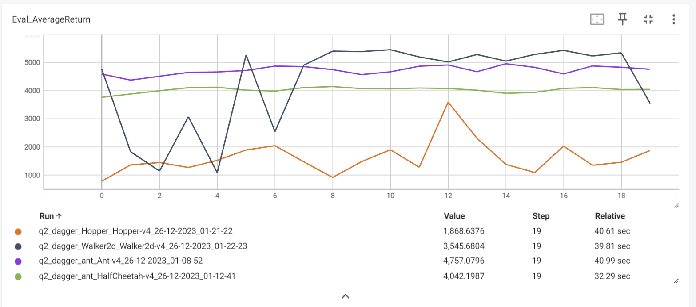

## Attempt of CS285 HW1
1. Self-Attempt solution for CS285 HW1. 
2. Implement DAgger and Behavior_clone algortihm. 
3. Train a distribution policy with neural network and nn.parameter. 
4. Use torch.distribution to infer a distribution by mean and log standard deviation. mean is created by a FNN and logstd is created by nn.parameter. 
5. loss = (-1) * distribution.log_prob(true_actions). (-1) is for minimizing the loss.

6. Demonstration of 20 epochs in each game env. 




## Stepstones 
Some of packages in requirements.txt are not suitable for some operating systems. Such as Ubuntu 22.04. Especially box2d-py and swig. Solution: Install swig first than rerun the `pip install -r requirements.txt`


We are using a MLP to train a distribution by torch.distribution. The learnable parameters are mean values that are coming from a feed forward network, and logstd that is a learnable nn.parameter. The loss function is defined as negative divergence between the distribution of actions from the expert and the distribution of actions from our training model's policies.  $ \|p_{\theta}^{S_t} -  p_{\pi}^{S_t} \|  $


The paper of DAgger is very helpful. 
Especially, we need to use our current model to generate the trajectories and than use the exper to relabel those trajectories' actions. In the other words, we use our model, or actor here to play the game and save the observation states in certain runs alone. Then use an expert aka the human or expert model to mark those observations with expert's actions. At this stage, we replace our actor's actions with expert's actions. And for each iteration, we concatenate the previous dataset with new dataset that we just created. That's the Dataset Aggregation.

`S. Ross, G. J. Gordon, and J. A. Bagnell, ‘A Reduction of Imitation Learning and Structured Prediction to No-Regret Online Learning’, arXiv [cs.LG]. 2011.`


> # Original HW1 instructions 

## Setup

You can run this code on your own machine or on Google Colab. 

1. **Local option:** If you choose to run locally, you will need to install MuJoCo and some Python packages; see [installation.md](installation.md) for instructions.
2. **Colab:** The first few sections of the notebook will install all required dependencies. You can try out the Colab option by clicking the badge below:

[](https://colab.research.google.com/github/berkeleydeeprlcourse/homework_fall2023/blob/master/hw1/cs285/scripts/run_hw1.ipynb)

## Complete the code

Fill in sections marked with `TODO`. In particular, edit
 - [policies/MLP_policy.py](cs285/policies/MLP_policy.py)
 - [infrastructure/utils.py](cs285/infrastructure/utils.py)
 - [scripts/run_hw1.py](cs285/scripts/run_hw1.py)

You have the option of running locally or on Colab using
 - [scripts/run_hw1.py](cs285/scripts/run_hw1.py) (if running locally) or [scripts/run_hw1.ipynb](cs285/scripts/run_hw1.ipynb) (if running on Colab)

See the homework pdf for more details.

## Run the code

Tip: While debugging, you probably want to keep the flag `--video_log_freq -1` which will disable video logging and speed up the experiment. However, feel free to remove it to save videos of your awesome policy!

If running on Colab, adjust the `#@params` in the `Args` class according to the commmand line arguments above.

### Section 1 (Behavior Cloning)
Command for problem 1:

```
python cs285/scripts/run_hw1.py \
	--expert_policy_file cs285/policies/experts/Ant.pkl \
	--env_name Ant-v4 --exp_name bc_ant --n_iter 1 \
	--expert_data cs285/expert_data/expert_data_Ant-v4.pkl \
	--video_log_freq -1
```

Make sure to also try another environment.
See the homework PDF for more details on what else you need to run.
To generate videos of the policy, remove the `--video_log_freq -1` flag.

### Section 2 (DAgger)
Command for section 1:
(Note the `--do_dagger` flag, and the higher value for `n_iter`)

```
python cs285/scripts/run_hw1.py \
    --expert_policy_file cs285/policies/experts/Ant.pkl \
    --env_name Ant-v4 --exp_name dagger_ant --n_iter 10 \
    --do_dagger --expert_data cs285/expert_data/expert_data_Ant-v4.pkl \
	--video_log_freq -1
```

Make sure to also try another environment.
See the homework PDF for more details on what else you need to run.

## Visualization the saved tensorboard event file:

You can visualize your runs using tensorboard:
```
tensorboard --logdir data
```

You will see scalar summaries as well as videos of your trained policies (in the 'images' tab).

You can choose to visualize specific runs with a comma-separated list:
```
tensorboard --logdir data/run1,data/run2,data/run3...
```

If running on Colab, you will be using the `%tensorboard` [line magic](https://ipython.readthedocs.io/en/stable/interactive/magics.html) to do the same thing; see the [notebook](cs285/scripts/run_hw1.ipynb) for more details.

